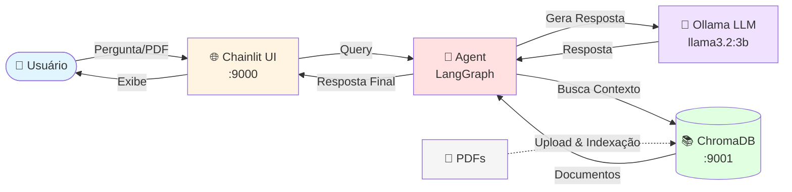
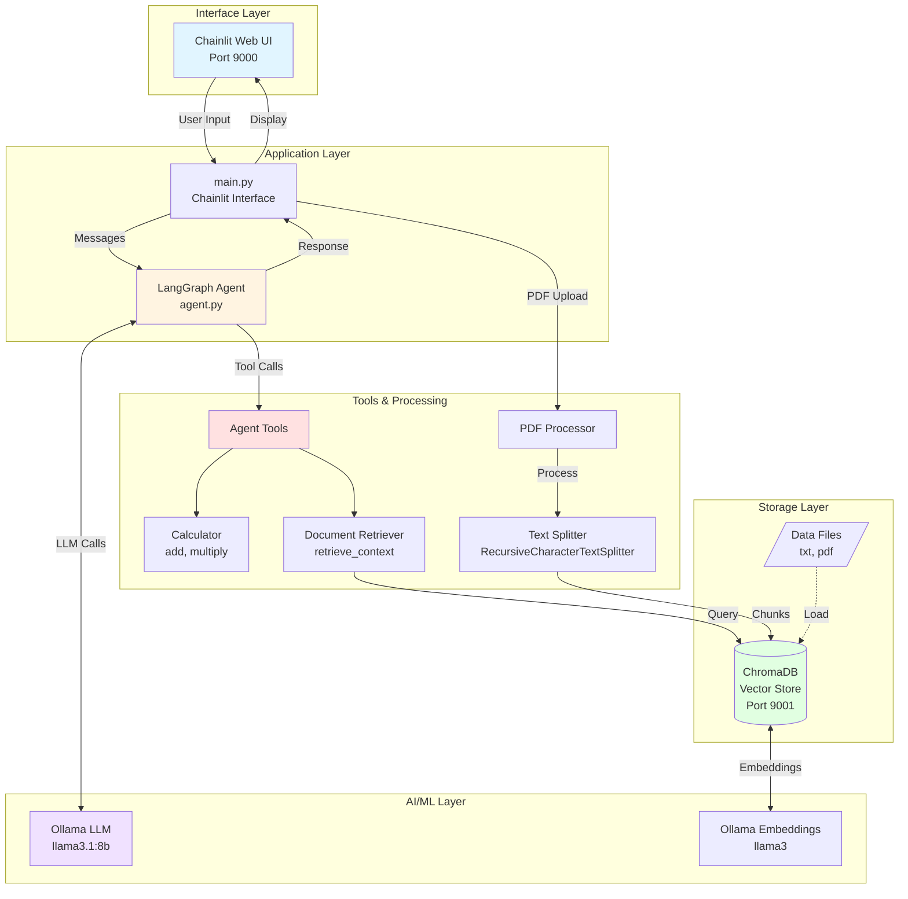

# Simple RAG - Agent Q&A

Sistema RAG (Retrieval-Augmented Generation) com agente inteligente usando LangChain, LangGraph, Ollama e ChromaDB.

## Como Rodar o Projeto

### 1. Iniciar ChromaDB (Docker)

Inicie o container do ChromaDB:

```bash
docker-compose up -d
```

Verifique se o ChromaDB está rodando:

```bash
docker ps
```

### 2. Configurar Ollama

Baixe o modelo Llama 3.2:

```bash
ollama pull llama3.2:3b
```

Inicie o servidor Ollama (em um terminal separado):

```bash
ollama serve
```

**Nota**: Deixe o Ollama rodando em background ou em outro terminal.

### 3. Instalar Dependências

```bash
pip install -e .
```

### 4. Executar a Aplicação

```bash
chainlit run simple_rag/main.py -w --host='0.0.0.0' --port=9000
```

Acesse a aplicação em: `http://localhost:9000`

## Arquitetura do Sistema

### Visão Simplificada



**Fluxo Principal:**
1. 📥 Usuário envia pergunta através da interface Chainlit
2. 🤖 Agent (LangGraph) processa a requisição
3. 🔍 Agent busca contexto relevante no ChromaDB
4. 🧠 LLM (Ollama) gera resposta baseada no contexto
5. 📤 Resposta é exibida ao usuário

### Visão Detalhada



### Componentes Principais

#### 1. Interface Layer
- **Chainlit Web UI**: Interface web interativa para comunicação com o agente
- Suporta upload de PDFs e chat em tempo real

#### 2. Application Layer
- **main.py**: Gerencia sessões de usuário, histórico de mensagens e processamento de PDFs
- **LangGraph Agent**: Orquestra o fluxo de decisão entre LLM e ferramentas

#### 3. AI/ML Layer
- **Ollama LLM**: Modelo de linguagem para geração de respostas (llama3.1:8b)
- **Ollama Embeddings**: Gera embeddings vetoriais para busca semântica

#### 4. Tools & Processing
- **Document** **Retriever**: Busca documentos relevantes no vectorstore
- **PDF Processor**: Extrai e processa texto de arquivos PDF
- **Text Splitter**: Divide documentos em chunks para melhor indexação

#### 5. Storage Layer
- **ChromaDB**: Banco de dados vetorial para armazenamento e busca semântica
- **Data Files**: Arquivos de texto e PDF com informações

### Fluxo de Dados

1. **Query Flow**: Usuário → Chainlit → Agent → LLM → Tools → ChromaDB → Resposta
2. **PDF Upload Flow**: PDF → Processor → Text Splitter → Embeddings → ChromaDB
3. **Retrieval Flow**: Query → Embeddings → ChromaDB → Similarity Search → Context

## Instalação

```bash
pip install -e .
```

## Uso

```bash
chainlit run simple_rag/main.py -w --host='0.0.0.0' --port=9000
```