# 📚 Agente Q&A com PDF usando RAG

Sistema de perguntas e respostas baseado em documentos PDF usando RAG (Retrieval-Augmented Generation), Chainlit, LangGraph e ChromaDB.

## 🎯 Visão Geral

Este projeto demonstra como construir um agente inteligente de Q&A que:

- **Processa documentos PDF** e extrai texto com preservação de metadados
- **Indexa conteúdo** em um banco de dados vetorial (ChromaDB)
- **Responde perguntas** baseado no conteúdo dos documentos
- **Cita fontes** com número de página e relevância
- **Interface interativa** via Chainlit com upload de arquivos
- **Arquitetura modular** usando LangGraph para workflow do agente
- **Totalmente dockerizado** com ChromaDB em container separado

## 🏗️ Arquitetura

```
┌─────────────────────────────────────────────────────────┐
│                    Docker Compose                        │
│                                                          │
│  ┌──────────────────────┐    ┌─────────────────────┐   │
│  │   ChromaDB Server    │◄───┤   RAG App           │   │
│  │   (Vector Store)     │    │   (Chainlit UI)     │   │
│  │                      │    │                     │   │
│  │   Port: 8000 (int)   │    │   - PDF Processor   │   │
│  │   Port: 8001 (ext)   │    │   - LangGraph       │   │
│  │                      │    │   - Embeddings      │   │
│  │   Volume Persistente │    │   - Agent           │   │
│  └──────────────────────┘    │                     │   │
│                               │   Port: 8000        │   │
│                               └─────────────────────┘   │
└─────────────────────────────────────────────────────────┘
```

### Componentes Principais

1. **ChromaDB** - Banco de dados vetorial para armazenamento e busca semântica
2. **LangGraph** - Orquestração do workflow do agente (análise → recuperação → geração)
3. **Chainlit** - Interface web interativa para chat e upload de PDFs
4. **LangChain** - Abstrações para LLMs e embeddings
5. **PyMuPDF** - Extração de texto de PDFs

## 🚀 Início Rápido

### Pré-requisitos

- Docker e Docker Compose instalados
- Chave de API da OpenAI ou Anthropic

### Instalação e Execução

1. **Clone o repositório**:
```bash
git clone <seu-repositorio>
cd project
```

2. **Configure as variáveis de ambiente**:
```bash
cp .env.example .env
# Edite o arquivo .env e adicione suas chaves de API
```

3. **Inicie a aplicação**:
```bash
docker-compose up -d
```

4. **Acesse a interface**:
- **Aplicação Chainlit**: http://localhost:8000
- **ChromaDB Admin** (opcional): http://localhost:8001

5. **Visualize os logs**:
```bash
docker-compose logs -f
```

## 📖 Como Usar

### 1. Fazer Upload de PDFs

1. Acesse http://localhost:8000
2. Clique no ícone de anexo (📎)
3. Selecione um ou mais arquivos PDF
4. Aguarde o processamento e indexação

### 2. Fazer Perguntas

Digite suas perguntas no chat. Exemplos:

```
"Quais são os principais tópicos discutidos no documento?"
"Explique o conceito de X mencionado no artigo"
"Quais são as conclusões apresentadas?"
```

### 3. Ver Fontes

As respostas incluem automaticamente:
- Nome do documento fonte
- Número da página
- Score de relevância

## 🛠️ Configuração

### Variáveis de Ambiente (.env)

```env
# Chaves de API LLM
OPENAI_API_KEY=sua_chave_openai_aqui
ANTHROPIC_API_KEY=sua_chave_anthropic_aqui

# Configuração ChromaDB
CHROMA_HOST=localhost
CHROMA_PORT=8001

# Configuração LLM
LLM_PROVIDER=openai
LLM_MODEL=gpt-4-turbo-preview
EMBEDDING_MODEL=sentence-transformers/all-MiniLM-L6-v2

# Debug
DEBUG=False
```

### Configuração YAML (config.yaml)

```yaml
chunking:
  tamanho_chunk: 1000
  sobreposicao_chunk: 200
  estrategia: "fixed"

recuperacao:
  top_k: 5
  limiar_similaridade: 0.7
  usar_reranking: false

llm:
  temperatura: 0.7
  max_tokens: 2000
  streaming: true

upload:
  max_tamanho_mb: 50
  formatos_permitidos:
    - "pdf"
```

## 🐳 Comandos Docker

### Desenvolvimento

```bash
# Iniciar todos os serviços
docker-compose up -d

# Ver logs em tempo real
docker-compose logs -f

# Ver logs apenas da aplicação
docker-compose logs -f rag-app

# Ver logs apenas do ChromaDB
docker-compose logs -f chromadb

# Parar serviços
docker-compose down

# Reconstruir a aplicação
docker-compose build rag-app

# Reiniciar apenas a aplicação
docker-compose restart rag-app
```

### Limpeza

```bash
# Parar e remover containers
docker-compose down

# Parar e remover containers + volumes (CUIDADO: apaga dados)
docker-compose down -v

# Remover imagens não utilizadas
docker image prune -a
```

## 📁 Estrutura do Projeto

```
project/
├── src/llm_rag/
│   ├── config.py              # Gerenciamento de configuração
│   ├── embeddings.py          # Modelos de embedding
│   ├── pdf_processor.py       # Processamento de PDF
│   ├── vector_store.py        # Interface ChromaDB
│   ├── agent.py               # Agente principal
│   ├── graph/                 # LangGraph workflow
│   │   ├── state.py          # Estado do grafo
│   │   ├── nodes.py          # Nós do grafo
│   │   └── workflow.py       # Definição do workflow
│   └── ui/
│       └── app.py            # Interface Chainlit
├── tests/                     # Testes
├── data/
│   ├── uploads/              # PDFs enviados
│   └── chroma/               # Dados ChromaDB (em volume)
├── Dockerfile                # Container da aplicação
├── docker-compose.yml        # Orquestração
├── config.yaml              # Configurações
├── .env                     # Variáveis de ambiente
└── pyproject.toml           # Dependências
```

## 🧪 Testes

### Executar Testes Localmente

```bash
# Instalar dependências
poetry install --with dev

# Executar todos os testes
poetry run pytest

# Executar com cobertura
poetry run pytest --cov=llm_rag

# Executar testes específicos
poetry run pytest tests/test_config.py
```

### Executar Testes no Docker

```bash
docker-compose exec rag-app pytest
```

## 🔧 Desenvolvimento Local (Sem Docker)

### 1. Instalar Dependências

```bash
# Instalar Poetry
curl -sSL https://install.python-poetry.org | python3 -

# Instalar dependências do projeto
poetry install --with dev

# Ativar ambiente virtual
poetry shell
```

### 2. Configurar Ambiente

```bash
cp .env.example .env
# Editar .env com suas chaves de API
```

### 3. Iniciar ChromaDB Localmente

```bash
# Opção 1: Usar Docker apenas para ChromaDB
docker run -d -p 8001:8000 \
  -v chromadb-data:/chroma/chroma \
  -e IS_PERSISTENT=TRUE \
  chromadb/chroma:latest

# Opção 2: Instalar ChromaDB localmente
pip install chromadb
chroma run --path ./data/chroma --port 8001
```

### 4. Executar Aplicação

```bash
chainlit run src/llm_rag/ui/app.py --host 0.0.0.0 --port 8000
```

## 📊 Workflow do Agente (LangGraph)

```mermaid
graph TD
    A[Início] --> B[Analisar Consulta]
    B -->|Precisa Recuperação| C[Recuperar Documentos]
    B -->|Não Precisa| F[Gerar Resposta]
    C --> D[Formatar Contexto]
    D --> E[Gerar Resposta com Contexto]
    E --> G[Fim]
    F --> G
```



### Nós do Grafo

1. **Analisar Consulta** - Determina se precisa buscar documentos
2. **Recuperar Documentos** - Busca chunks relevantes no ChromaDB
3. **Formatar Contexto** - Organiza documentos recuperados
4. **Gerar Resposta** - Usa LLM para gerar resposta fundamentada

## 🔒 Segurança

- Nunca commite o arquivo `.env` com chaves de API
- Use variáveis de ambiente para informações sensíveis
- Limite o tamanho de upload de PDFs (padrão: 50MB)
- Valide formatos de arquivo antes do processamento

## 🐛 Troubleshooting

### Erro: "Não foi possível conectar ao ChromaDB"

```bash
# Verifique se o ChromaDB está rodando
docker-compose ps

# Verifique os logs do ChromaDB
docker-compose logs chromadb

# Reinicie o ChromaDB
docker-compose restart chromadb
```

### Erro: "OPENAI_API_KEY não configurada"

```bash
# Verifique se o .env existe e está preenchido
cat .env

# Recrie o container com novas variáveis
docker-compose down
docker-compose up -d
```

### Erro: "Out of Memory"

```bash
# Aumente recursos do Docker Desktop
# Ou reduza tamanho dos chunks em config.yaml

chunking:
  tamanho_chunk: 500  # Reduzir de 1000 para 500
```

### PDFs não são processados

```bash
# Verifique permissões do diretório de uploads
ls -la data/uploads/

# Verifique logs da aplicação
docker-compose logs rag-app

# Verifique formato e integridade do PDF
file seu_arquivo.pdf
```

## 📈 Melhorias Futuras

- [ ] Suporte para mais formatos (DOCX, TXT, Markdown)
- [ ] Re-ranking de resultados com modelos especializados
- [ ] Conversational memory com histórico persistente
- [ ] Suporte multi-idioma
- [ ] Autenticação de usuários
- [ ] API REST para integração
- [ ] Métricas e observabilidade (Prometheus + Grafana)
- [ ] Deployment em cloud (AWS, GCP, Azure)

## 🤝 Contribuindo

Contribuições são bem-vindas! Por favor:

1. Faça fork do projeto
2. Crie uma branch para sua feature (`git checkout -b feature/AmazingFeature`)
3. Commit suas mudanças (`git commit -m 'Add some AmazingFeature'`)
4. Push para a branch (`git push origin feature/AmazingFeature`)
5. Abra um Pull Request

## 📝 Licença

Este projeto está sob a licença MIT. Veja o arquivo `LICENSE` para mais detalhes.

## 👥 Autores

- **Flavio De Oliveira Vieira** - flovieira@rd.com.br

## 🙏 Agradecimentos

- [Chainlit](https://chainlit.io/) - Framework para interfaces de chat
- [LangGraph](https://github.com/langchain-ai/langgraph) - Orquestração de agentes
- [ChromaDB](https://www.trychroma.com/) - Banco de dados vetorial
- [LangChain](https://www.langchain.com/) - Framework LLM
- [PyMuPDF](https://pymupdf.readthedocs.io/) - Manipulação de PDFs

## 📞 Suporte

Para questões e suporte:
- Abra uma issue no GitHub
- Entre em contato: flovieira@rd.com.br

---

**Desenvolvido com ❤️ usando Python, LangChain e Docker**
